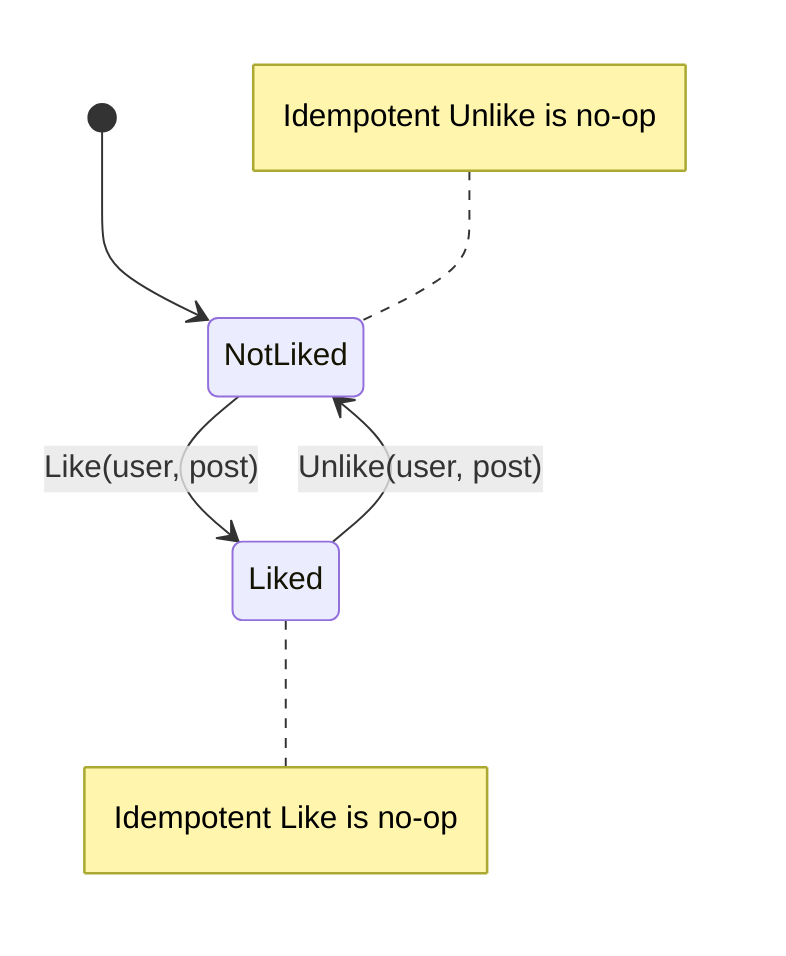

# What Really Happens When Millions of People “Like” the Same Post at Once? — Deep Dive

You shared a concise, LinkedIn‑style take on the Thundering Herd/Celebrity problem. This article expands that into a **practical, end‑to‑end design** for a production “Like” system that can survive viral spikes, multi‑region traffic, and correctness pitfalls.

> **Thesis:** Don’t increment a single counter in your database. **Shard, buffer, dedupe, and aggregate**—with explicit choices about **consistency**, **idempotency**, and **multi‑region conflict resolution**.

---

## TL;DR

- **Hotspot writes** to a single DB row cause locks, queueing, and collapse under load.  
- Use **sharded counters** in **in‑memory stores (Redis)** + **atomic increments**.  
- Ensure **idempotency** (user can’t double‑like) with **idempotency keys** or **set membership** checked in a **Lua script**.  
- **Aggregate** shards on a cadence (or continuously via streams) into a **materialized view**.  
- Expose **eventually consistent** read paths; smooth UI with optimistic updates + reconciliation.  
- In multi‑region, use **CRDT PN‑Counters** or **per‑region shards** with periodic merge to avoid conflicts.  
- **Monitor** hot keys, p95/p99 latencies, error budgets, and shard skew.  

---

## 1) Workload & Requirements

### Functional
- **Like/Unlike** a post. Prevent duplicate likes by the same user.
- Show **total count** on post (fast), sometimes with **viewer‑specific state** (did *I* like this?).

### Non‑Functional
- **Latency SLO**: p95 < 50–100 ms for writes (like action), p95 < 20–50 ms for reads (count/state).  
- **Throughput**: spikes of **100k–1M likes/min** on a hot post.  
- **Availability**: 99.9%+ for read/write under celebrity traffic.
- **Cost**: scale horizontally; avoid over‑provisioning DB.

### Data Characteristics
- Likes are **tiny writes** but massively **concurrent** on **a few hot keys**.  
- Read traffic dominates; the **top 0.1% posts** may drive **>90%** of write pressure during spikes.

---

## 2) Why Naive DB Updates Fail

A straightforward approach:

```sql
UPDATE posts SET like_count = like_count + 1 WHERE id = $post_id;
```

**Problems at scale:**
- **Row/tuple locks** serialize concurrent increments.
- **Redo/Write‑ahead logs** and index updates saturate I/O.
- **Connection pools** back up; tail latencies explode.
- Horizontal read replicas don’t help write hotspots.

**Conclusion:** The DB is a **terrible place** to concentrate micro‑increments during spikes.

---

## 3) Sharded Counters (Core Pattern)

### Key idea
Split one logical counter into **N shards**:

```
likes:{post_id}:shard:{0..N-1}
```

Each like hits a **random shard** (or consistent hash of user_id/post_id). Then aggregate periodically.

**Choosing N:**  
- Start with **N = 64 or 128** per post, adaptively create on first spike.  
- Ensure per‑shard QPS stays below your **Redis** (or similar) key hotness limits.

**Write path (happy path):**
```text
Client → API → Shard Router → Redis INCR likes:{post}:shard:{k}
```

**Read path (fast):**
- Return **materialized total** from cache (or DB) that lags by a few seconds, or  
- Sum shards on demand only if **no materialized view** available (slow path).

---

## 4) Idempotency & Double‑Click Protection

You must prevent: **same user liking same post multiple times** despite retries, refreshes, or multi‑device.

### Option A: Idempotency key per like attempt
- Key: `like:{post_id}:{user_id}` with a TTL or permanent record.
- Write path uses **SETNX** to claim; if exists, it’s a duplicate.

### Option B: Atomic script (Redis Lua) — check membership + increment

```lua
-- KEYS[1] = set key (who liked)
-- KEYS[2] = counter shard key
-- ARGV[1] = user_id

if redis.call('SISMEMBER', KEYS[1], ARGV[1]) == 1 then
  return 0 -- already liked, no increment
else
  redis.call('SADD', KEYS[1], ARGV[1])
  redis.call('INCR', KEYS[2])
  return 1 -- incremented
end
```

- **Pros:** single round trip, atomic.  
- **Cons:** the set grows with unique users; you may **shard** the set or **expire** after post cool‑down.

### Unlike support
Use a **PN‑Counter** abstraction (see §10) or store membership (`SREM`) and **DECR** a shard (with guardrails to avoid negative totals).

---

## 5) Ingestion, Buffering & Backpressure

Put a **durable stream** between the API and the aggregator to smooth bursts:

- API writes **like events** to **Kafka/Redpanda** with keys = `post_id` (to keep order per post).  
- The **fast path** still increments Redis so the UI responds instantly.
- Aggregators consume the stream to **rebuild** or **correct** counters, supporting replay after failures.

**Event schema** (append‑only):
```json
{
  "event": "like|unlike",
  "user_id": "u_123",
  "post_id": "p_456",
  "ts": 1739251205,
  "idempotency": "u_123:p_456:1739251205"
}
```

**Backpressure:**
- Rate‑limit per user/IP; shed excess traffic gracefully.
- If Redis pressure rises, **sample** writes (client or edge) and let background aggregation fill the gap.

---

## 6) Aggregation & Materialized Views

Two common strategies:

### (a) Batch aggregation
- Every **T seconds** (e.g., 1–5 s), workers **SCAN** shards for hot posts, **SUM** counts, and write to `post_like_totals:{post_id}` (Redis/DB).

### (b) Streaming aggregation
- Subscribe to **like events** and update **materialized totals** incrementally.
- Use **exactly‑once** or **effectively once** semantics with **idempotent consumer** (store last processed offset per post).

**Storage:**
- Short‑term **Redis** for serving; periodic flush to **DB** for durability/analytics.
- Cold storage (object store) keeps the **event log** for audit/rebuilds.

---

## 7) Read Paths & Caching

- **Post detail page:** read `post_like_totals:{post_id}` from Redis cache; fall back to DB on miss.
- **Feed:** prefetch totals for the **top K posts** in the viewport; warm the cache via **read‑through**.
- **Client optimism:** increment count locally on tap; reconcile if server denies (idempotency failure).

**Cache invalidation**: write the fresh aggregate and **publish** an invalidation message to UI edges (WebSockets/SSE) for live updates.

---

## 8) Correctness: Ordering, Duplicates, and Replays

**Duplicates:** Retries or network glitches can **replay** likes.  
- Use **idempotency keys** or a **(user, post) membership set** to ensure one effective like.

**Ordering:** Like → Unlike → Like across devices may arrive out of order.  
- Resolve by **timestamp** with a small skew tolerance, or use a **Lamport/Hybrid Logical Clock** to order per user:post.

**Rebuilds:** If you lose Redis, **replay** events from Kafka and **reconstruct** totals + sets.

---

## 9) Hot‑Key Mitigations Beyond Sharding

- **Jittered writes**: add random client delay (tens of ms) to smear a spike.  
- **Edge workers**: coalesce increments at CDN/edge and flush periodically.  
- **Adaptive shard count**: detect hot posts and increase N on the fly (with a mapping version).
- **Key hashing**: e.g., `shard = hash(user_id) % N` to avoid random skew.

---

## 10) CRDTs & Multi‑Region Active‑Active

If you run **active‑active** across regions, you need **conflict‑free** merges.

### PN‑Counter (CRDT) for Like/Unlike
- Maintain a **G‑Counter** for likes and a **G‑Counter** for unlikes **per region**.  
- Merge by **component‑wise max** of per‑region vectors, then compute `total = sum(L) - sum(U)`.
- This naturally resolves concurrent like/unlike events across regions without coordination.

**Shape:**
```text
L = [l_us, l_eu, l_apac, ...]
U = [u_us, u_eu, u_apac, ...]
Total = ΣL - ΣU
```

**Trade‑offs:**
- Slightly higher storage and merge complexity.
- Strong convergence and offline tolerance.

---

## 11) Data Model (Minimal Set)

- **Events (append‑only):** `like|unlike`, `(user_id, post_id, ts, idempotency)`  
- **Membership:** `liked_users:{post_id}` as a Redis Set **(optional/partial)** for hot posts; or **Bloom filter** for memory‑efficient positive checks (with a DB of record for truth).  
- **Sharded counters:** `likes:{post_id}:shard:{k}`  
- **Materialized total:** `post_like_totals:{post_id}`  
- **Idempotency ledger:** `idem:{user_id}:{post_id}` with TTL.

---

## 12) API Design (Sketch)

```http
POST /v1/posts/{post_id}/likes
Authorization: Bearer <jwt>
Idempotency-Key: <uuid or user_id:post_id:ts>
```

**Responses**
- `201 Created` with `{ liked: true, total: approx_count }`
- `200 OK` if already liked (idempotent replay)
- `409 Conflict` if toggling rules violated (e.g., unlike without prior like)

**Unlike:** `DELETE /v1/posts/{post_id}/likes`

---

## 13) Example: Redis Lua for Like/Unlike (Idempotent)

```lua
-- Keys
-- KEYS[1] = liked_users:{post}
-- KEYS[2] = likes:{post}:shard:{k}
-- KEYS[3] = unlikes:{post}:shard:{k} (only for PN variant)
-- Args
-- ARGV[1] = user_id
-- ARGV[2] = action ("like"|"unlike")

local member = redis.call('SISMEMBER', KEYS[1], ARGV[1])
if ARGV[2] == 'like' then
  if member == 1 then return 'noop' end
  redis.call('SADD', KEYS[1], ARGV[1])
  redis.call('INCR', KEYS[2])
  return 'liked'
else
  if member == 0 then return 'noop' end
  redis.call('SREM', KEYS[1], ARGV[1])
  if KEYS[3] then redis.call('INCR', KEYS[3]) end -- if using PN‑counter
  return 'unliked'
end
```

> For memory control, shard `liked_users:{post}` by hash(user_id) and/or **expire** after cool‑down.

---

## 14) Testing & Load Modeling

**Throughput math (back‑of‑envelope):**  
If a hot post sees **L = 200k likes/min = ~3.3k likes/s**, and you set **N = 128 shards**, then per‑shard QPS ≈ **26 ops/s** (easy for Redis).

**Load test plan:**
- **Write path:** ramp to expected peak ×1.5; track p50/p95/p99 latency, error rate, and shard skew.  
- **Read path:** simulate feed loads (hundreds of posts), ensure cache hit rate > 95%.
- **Failure tests:** kill Redis node; verify replay from Kafka can rebuild counts.

**Chaos:** drop 5–10% of like events randomly; ensure idempotency and PN merges keep totals sane.

---

## 15) Observability & Operations

**Metrics**
- Redis: ops/s per shard, hot keys, memory, evictions.  
- Aggregator: lag (seconds), batch sizes, rebuild times.  
- API: rate limits triggered, p95/p99, 4xx/5xx.  
- Business: like/unlike ratio, toggle churn, regional skew.

**Alerts**
- Materialized view staleness > threshold (e.g., 10 s).  
- Shard imbalance > 3× median.  
- Error budget burn > target.

**Dashboards**
- Top hot posts
- Per‑region convergence (CRDT vector deltas)
- Replay backlog

---

## 16) Security & Abuse

- **AuthZ:** Only authenticated users can like. Enforce **one‑like per (user, post)**.  
- **Abuse mitigation:** rate limits, device fingerprints, anomaly detection for scripted likes.  
- **Privacy:** avoid exposing the list of who liked at massive scale (heavy fan‑out); paginate with **opaque cursors**.

---

## 17) UI/UX Considerations

- **Optimistic update**: bump count instantly on tap; revert only on failure.  
- **Animation**: delayed easing hides discrete aggregation steps.  
- **Hint eventual consistency** subtly: e.g., “~12.3k likes”.  
- **Pinned posts**: pre‑warm counts; increase shard count on mount.

---

## 18) Putting It All Together (Diagrams)

### Architecture (Mermaid)
```mermaid
flowchart LR
  C[Client] -->|Like/Unlike| A[API Gateway]
  A --> R[Redis Shard Router]
  R --> R1[(Redis Shard 1)]
  R --> R2[(Redis Shard 2)]
  R --> RN[(Redis Shard N)]
  A --> K[(Kafka/Stream)]
  K --> AGG[Aggregator(s)]
  AGG --> T[(Materialized Totals Cache)]
  AGG --> DB[(SQL/NoSQL for durability)]
  T --> UI[Feed/UI Reads]
```

### Like/Unlike State Machine (Mermaid)


---

## 19) Alternatives & Trade‑offs

- **Direct DB atomic counters** (e.g., Postgres `UPDATE ... RETURNING`): simple but collapse under celebrity spikes.  
- **Memcached counters**: fast but lack durability and rich atomic scripts.  
- **DynamoDB atomic counters**: scale well; still recommend sharding hot keys and using streams for aggregation.  
- **CRDT‑only approach** (skip Redis shards): elegant convergence; throughput depends on your CRDT store’s hot‑key limits.  

---

## 20) Final Takeaways

- The Like button is deceptively hard at global scale.  
- **Sharded, idempotent, aggregated** designs are the winning baseline.  
- Add **CRDTs** for multi‑region convergence without coordination.  
- Treat accuracy as **eventual**; enforce UX that embraces small delays and jumps.  
- Invest in **observability** and **replay** to recover from failures.

---

## Appendix: Config & Snippets

**Kafka topic (likes.events)**
```properties
cleanup.policy=delete
retention.ms=604800000      # 7 days
min.insync.replicas=2
partitions=128              # keyed by post_id
```

**Aggregator pseudo (Node/TS)**
```ts
for await (const msg of kafka.consumer('likes.events')) {
  const {event, user_id, post_id, ts} = JSON.parse(msg.value);
  // idempotent collapse by (user,post) window if needed
  if (event === 'like') incrShard(post_id, user_id);
  else if (event === 'unlike') decrShard(post_id, user_id);
  scheduleMaterialize(post_id);
}
```

**Materialize total (Node/TS)**
```ts
async function materialize(postId: string) {
  const keys = await redis.keys(`likes:${postId}:shard:*`);
  let sum = 0; for (const k of keys) sum += Number(await redis.get(k) || 0);
  await redis.set(`post_like_totals:${postId}`, String(sum), { EX: 60 });
  await db.query('UPDATE posts SET like_count = $1 WHERE id = $2', [sum, postId]);
}
```

---


