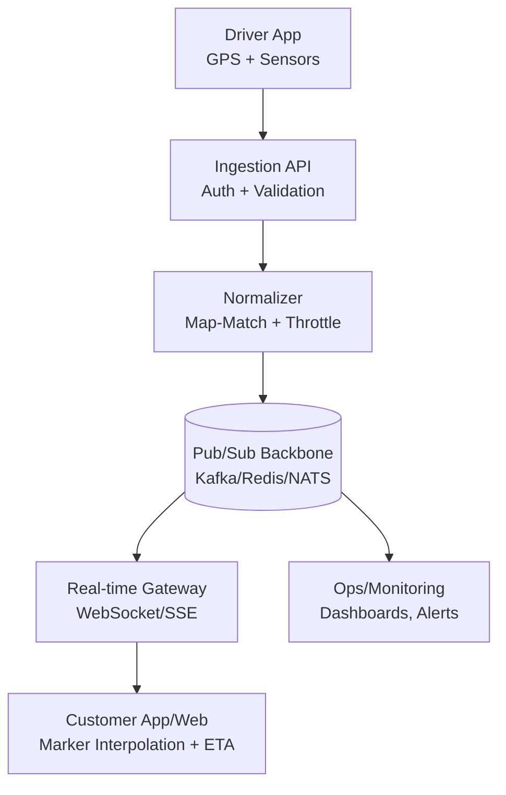

# The Instant Map: Real‑Time Delivery Tracking Explained

We’ve all watched the little scooter glide across the map without ever hitting refresh.  
This post explains **how food‑delivery apps stream a rider’s location to your phone in real time**, the **architecture choices** behind it, and **practical trade‑offs** for accuracy, battery, and cost.

> **Core idea:** Maintain a **persistent connection** to the client (WebSocket/SSE), **publish** rider GPS updates to a **pub/sub backbone**, and **animate** smoothly between points on the client.

---

## TL;DR

- **Driver app** samples GPS (1–5s) with smart throttling.
- **Backend** validates, normalizes, and **publishes** updates to an **order-scoped stream**.
- **Real‑time gateway** pushes updates to the customer over **WebSockets** or **Server‑Sent Events (SSE)**.
- **Client** renders with **interpolation + bearing** for smooth motion.
- Add **heartbeats, auth, map‑matching, de‑jitter**, and **reconnect** logic for reliability.

---

## Architecture at a Glance

> If you downloaded the PNG diagram previously, place it alongside this file and keep the name below. Otherwise, the Mermaid diagram will render if your MDX toolchain supports it.


Or use a Mermaid diagram (requires Mermaid support in your MDX toolchain):



---

## 1) Driver App: Capturing Location Reliably

**Objectives:** accuracy when moving, battery savings when idle, resiliency on flaky networks.

- **Sampling strategy**
  - Active delivery: 1–5 s; idle: 10–60 s.
  - Send **only on significant movement** (e.g., >15–25 m or heading change >10–15°).
- **Foreground service / background modes**
  - Android: **Foreground Service** with a persistent notification.
  - iOS: **background location updates** (info.plist capability) during active trips.
- **Packet contents**
  - `{orderId, lat, lng, ts, speed, bearing, accuracy, seq}` (seq = monotonically increasing).
- **Battery/data tips**
  - **Adaptive accuracy** (coarse vs. high) based on motion.
  - **Batch + compress** (gzip/deflate or protobuf).
- **Edge handling**
  - **Dead reckoning** with accelerometer/gyroscope for short GPS loss.
  - **Backoff + retry** with exponential backoff; queue when offline.

---

## 2) Ingestion: Validate, Normalize, Map‑Match

**API** receives updates, authenticates the rider, and normalizes for consistent downstream behavior.

- **Auth**: short‑lived JWT tied to `{driverId, orderId, role}`; rotate frequently.
- **Validation**:
  - Reject **impossible jumps** (>300 km/h), **duplicate seq**, **stale ts**.
  - Clamp precision to **5–6 decimal places**.
- **Normalization**:
  - Optionally **map‑match** to roads (OSRM/Valhalla/Mapbox) for nicer paths.
  - **Throttle** fan‑out rate (e.g., publish ≤1–2 Hz per order).
- **Persistence strategy (optional)**:
  - Hot path: **ephemeral** (in‑memory + pub/sub).
  - Warm path: **TTL store** (Redis/KeyDB) for last known state.
  - Cold path: **events to object storage** (S3/GCS) for audit/analytics.

---

## 3) Pub/Sub: Decouple Producers and Consumers

Use a backbone to **fan‑out** updates to all subscribers (customer app, restaurant, ops).

- **Topics/streams**
  - `locations.order.{ORDER_ID}` for targeted fan‑out.
  - `locations.driver.{DRIVER_ID}` for ops/agent view.
- **Partitioning**
  - Partition by **orderId** to preserve order and scale.
- **Delivery semantics**
  - **At‑least once** is fine; ensure **idempotency** using `{orderId, seq}`.
- **Retention**
  - Short (e.g., minutes) for streams; longer for analytics pipelines.

**Common choices:** Kafka, Redis Streams/PubSub, NATS, RabbitMQ, or managed RT services (Pusher/Ably).

---

## 4) Real‑Time Gateway: Push, Don’t Poll

Keep a **persistent connection** open to the client and **push** location updates immediately.

### WebSockets

- **Pros:** bi‑directional, low latency, works on web + mobile.
- **Cons:** needs **heartbeat** (ping/pong), sticky sessions or shared state.

**Client (browser)**
```ts
const ws = new WebSocket(`wss://rt.example.com?orderId=${orderId}&token=${jwt}`);
ws.onmessage = (e) => update(JSON.parse(e.data));  // {lat,lng,bearing,ts,seq}
ws.onclose = () => setTimeout(reconnect, 1000);
```

**Server (Node/Express + ws pseudo)**
```ts
wss.on('connection', (socket, req) => {
  const {orderId, token} = parseQuery(req.url);
  const sub = pubsub.subscribe(`locations.order.${orderId}`, msg => {
    socket.send(JSON.stringify(msg));
  });
  const interval = setInterval(() => socket.ping(), 15000); // heartbeat
  socket.on('close', () => { clearInterval(interval); sub.unsubscribe(); });
});
```

### Server‑Sent Events (SSE)

- **Pros:** simpler (one‑way), auto‑reconnect, HTTP‑friendly.
- **Cons:** server→client only; no binary.

**Server (Express)**
```ts
app.get('/sse/orders/:orderId', auth, (req, res) => {
  res.set({'Content-Type':'text/event-stream','Cache-Control':'no-cache','Connection':'keep-alive'});
  const sub = pubsub.subscribe(`locations.order.${req.params.orderId}`, msg => {
    res.write(`data: ${JSON.stringify(msg)}\n\n`);
  });
  req.on('close', () => sub.unsubscribe());
});
```

---

## 5) Client Rendering: Make It Look Smooth

**Goal:** avoid “teleporting” markers and jitter.

- **Time‑aware interpolation**
  - Keep a **small buffer** (e.g., 500–1500 ms) and **interpolate** between points by `ts`.
  - Fall back to **extrapolation** for short gaps; snap back when a newer point arrives.
- **Bearing & rotation**
  - Rotate the vehicle icon toward heading; damp sudden turns with easing.
- **Map camera rules**
  - Auto‑follow until the user pans; then show a **“Re‑center”** button.
- **De‑jitter**
  - Ignore tiny zigzags by applying a **Kalman filter** or simple thresholding.

Example interpolation (pseudo):
```ts
function lerp(a:number,b:number,t:number){return a+(b-a)*t;}
function interpolate(p1, p2, now){
  const t = Math.min(1, Math.max(0, (now - p1.ts) / (p2.ts - p1.ts)));
  return { lat: lerp(p1.lat, p2.lat, t), lng: lerp(p1.lng, p2.lng, t) };
}
```

---

## Reliability, Scale, and Cost

- **Heartbeats & timeouts:** detect dead sockets quickly; auto‑reconnect.
- **Backpressure:** throttle per‑order outgoing rate; drop superseded points.
- **Horizontal scaling:**
  - Terminate sockets on a **real‑time edge layer** (Node/Go/Elixir).
  - Share subscriptions via **pub/sub**; avoid per‑node state.
- **Security:**
  - **Scoped tokens** (order‑bound), short TTLs, rotate on handoff.
  - Server checks **driver ↔ order** binding on every publish.
- **Observability:**
  - Metrics: open sockets, msg fan‑out rate, p95 E2E latency, reconnects.
  - Traces from **ingest → pub/sub → gateway → client**.
- **Cost controls:**
  - Lower update frequency at low speeds.
  - Quantize payloads; compress; use binary codecs (protobuf).

---

## Privacy & Safety

- Share only **position + minimal metadata** to the ordering customer.
- **Stop streaming** when delivery completes or order is canceled.
- **Retention**: short‑term for ops (hours/days), longer only with legal basis.
- **Anonymize** rider PII in analytics; never expose raw historical trails to customers.

---

## Reference Implementation (Minimal)

**Driver → Ingest**
```http
POST /v1/driver/location
Authorization: Bearer <jwt>
Content-Type: application/json

[
  {"orderId":"O123","seq":101,"lat":28.4575,"lng":77.0266,"bearing":210,"speed":6.4,"ts":1739251205123},
  {"orderId":"O123","seq":102,"lat":28.4568,"lng":77.0240,"bearing":215,"speed":7.1,"ts":1739251207121}
]
```

**Kafka topic config**
```properties
# topic: locations.order
cleanup.policy=delete
retention.ms=600000        # 10 minutes
min.insync.replicas=2
```

**Redis last-known state (TTL)**
```bash
HSET order:O123 last '{"lat":28.4568,"lng":77.0240,"ts":1739251207121}'
EXPIRE order:O123 900
```

---

## Test Plan

- **Simulator**: generate trajectories with noise; replay at 1–5 Hz.
- **Chaos**: drop 10–20% packets; randomize order; inject clock skew ±2 s.
- **Load**: N riders × U users per order (fan‑out), measure **E2E latency** and **drop rate**.
- **Battery**: A/B test sampling intervals and accuracy modes on real devices.

---

## Common Pitfalls & Fixes

| Symptom | Likely Cause | Fix |
|---|---|---|
| Marker “teleports” | Out‑of‑order or bursty packets | Buffer by time window; sort by `ts`; use `seq` to discard old |
| Jitter on slow movement | GPS noise | Thresholding, Kalman filter, or map‑matching |
| High battery drain | Over‑frequent updates / high‑accuracy GPS | Adaptive intervals; only high accuracy when needed |
| Stale map after reconnection | Missed last state | On reconnect, **fetch last-known** + resume stream |
| Leaked streams after order end | Missing lifecycle hooks | Enforce server‑side TTL & server‑initiated unsubscribe |

---

## Final Takeaway

Real‑time delivery tracking is a **push‑based**, **event‑driven** pipeline:

**Driver App → Ingestion → Pub/Sub → Real‑Time Gateway → Customer UI**

With the right guardrails—**auth, buffering, interpolation, and observability**—you get low‑latency, smooth tracking that *feels* instant without a single refresh.

---

## Related Reading

- Designing pub/sub with Kafka vs. Redis Streams  
- Handling out‑of‑order events in real‑time UIs  
- Mobile GPS accuracy, power trade‑offs, and dead reckoning
